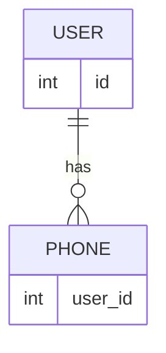

# Relationships

- Uno a uno
- Uno a muchos
- Uno a traves (de paso)
- Polimorfica (requiere una tabla para relacionar)

Las relaciones se pueden establecer unicamente a traves de los modelos, o en conjunto con la integridad referencial de la base de datos.


## migration

Para nombrar la relacion en la migración __model_id__, y el tipo por default es unsignedBigInteger.


## model



Se definen las relaciones
- USER __hasOne__ PHONE en singular _User::phone_
- PHONE __belongsTo__ USER en plural _Phone::users_


## controller

Al llamar el modelo trae la relación, para llamar indicamos el modelo y el metodo que define la relacion, y el atributo ```$user->phone->prefix```

